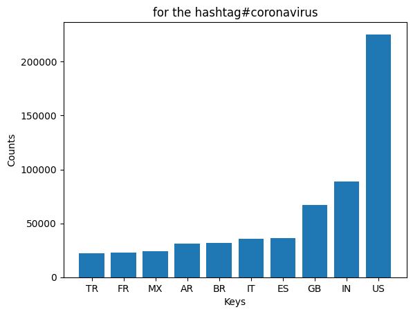
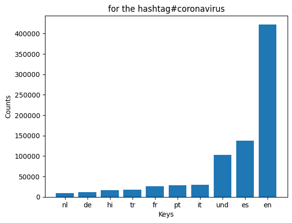
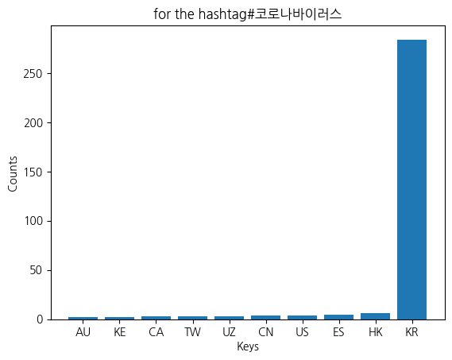
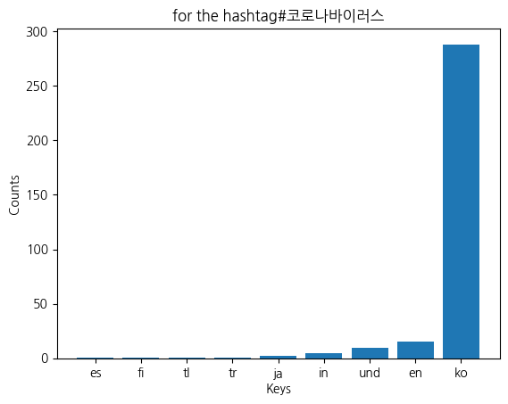
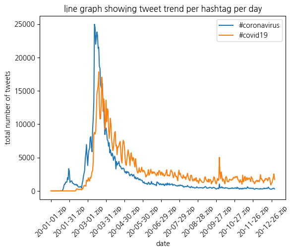

# Coronavirus Twitter Analysis

## Overview

This project analyzes approximately 1.1 billion geotagged tweets from 2020 to track the global spread of coronavirus-related discourse on social media. Using the MapReduce algorithm, tweets were processed for the year 2020, and then analysed to find trends in country and language.

## Map reduce algorithm walk through 

The pipeline is as follows:

1. Map — `src/map.py` processes each day's zip file, scanning every tweet for target hashtags and recording usage counts broken down by **language** and **country**. run_maps.py runs the mapper on all the zip files 

2. Reduce — `src/reduce.py` merges all daily output files into two aggregated files: one per language, one per country.

3.Visualize — `src/visualize.py` generates bar charts of the top 10 languages/countries for a given hashtag, and `src/alternative_reduce.py` generates time-series line plots showing hashtag usage trends over the course of 2020.

All map jobs were run in parallel on a remote server using `nohup` and `&` to handlethe scale of the dataset efficiently.

## Results

### #coronavirus — Top 10 Countries

### #coronavirus — Top 10 Languages

### #코로나바이러스 — Top 10 Countries

### #코로나바이러스 — Top 10 Languages

### Hashtag Trends Over Time (Alternative Reduce)

## Technologies Used

- Python (json, argparse, matplotlib, glob)
- Bash scripting (nohup, &, shell globbing)
- MapReduce design pattern
- Dataset: ~1.1 billion geotagged tweets (2020)
